# Galerie — vitrine Design System

Captures de la page de dev `/dev/design-system` (`packages/plateforme/src/app/dev/design-system/page.tsx`), qui monte côte à côte les primitives `components/ui` (colonne verte, source unique) et les recettes ad hoc relevées dans l'inventaire [RATIONALISATION_UI.md](./RATIONALISATION_UI.md) (colonne orange). Les identifiants A1…K3 renvoient aux lignes de l'inventaire.

**Voir en direct** : `pnpm --filter @savr/plateforme dev` puis <http://localhost:3001/dev/design-system> (404 sur tout build de production). **Régénérer les captures** : `CHROMIUM_PATH=… node docs/design-system/captures.mjs`.

## Vue d'ensemble

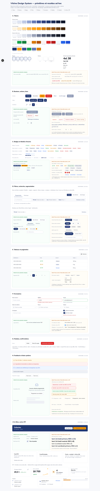

## A. Tokens (A1 à A10)

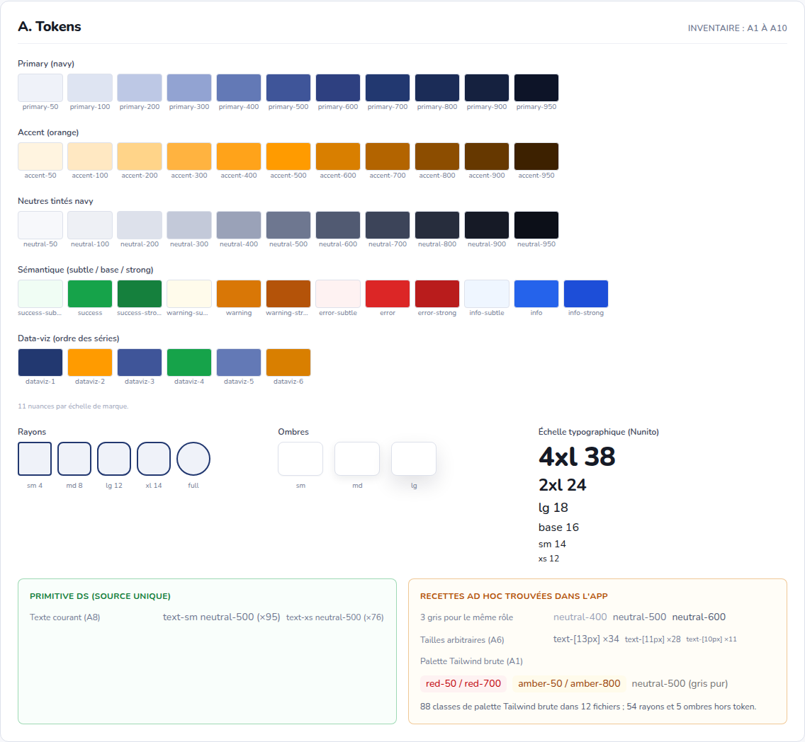

## B. Boutons, actions, liens (B1 à B11)

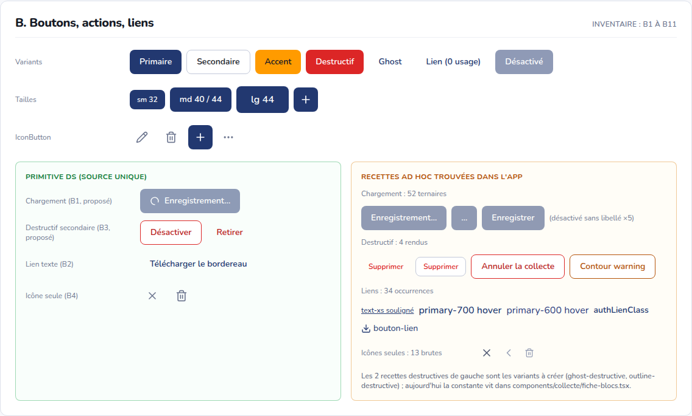

## C. Badges et libellés d'enums (C1 à C15)

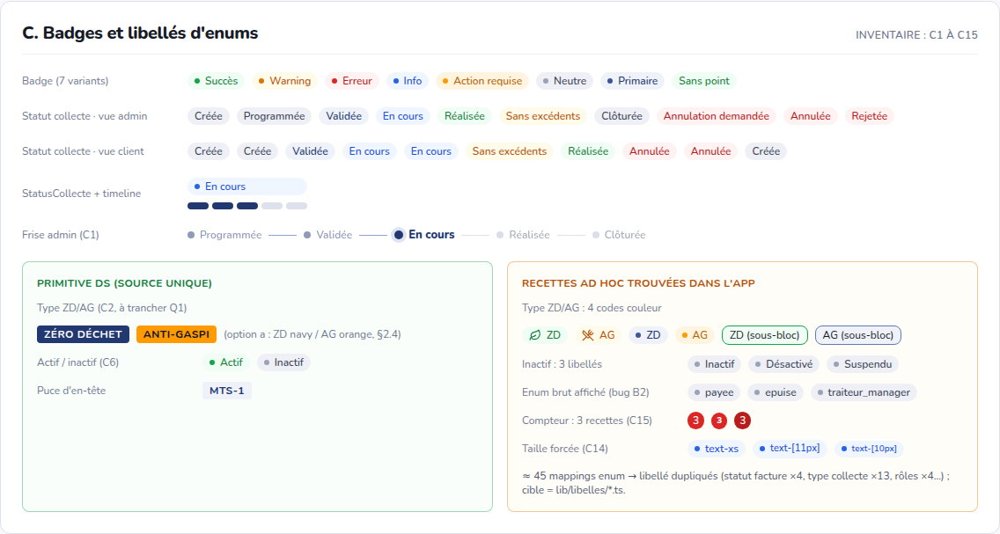

## D. Filtres, recherche, segmentation (D1 à D11)

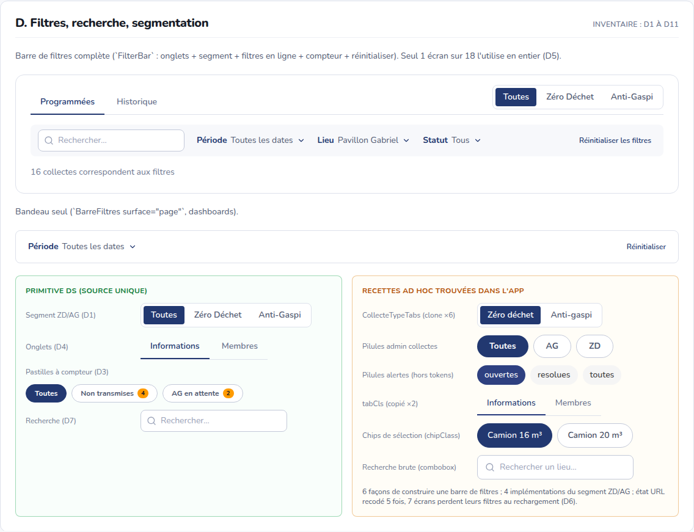

## E. Tableaux et pagination (E1 à E6)

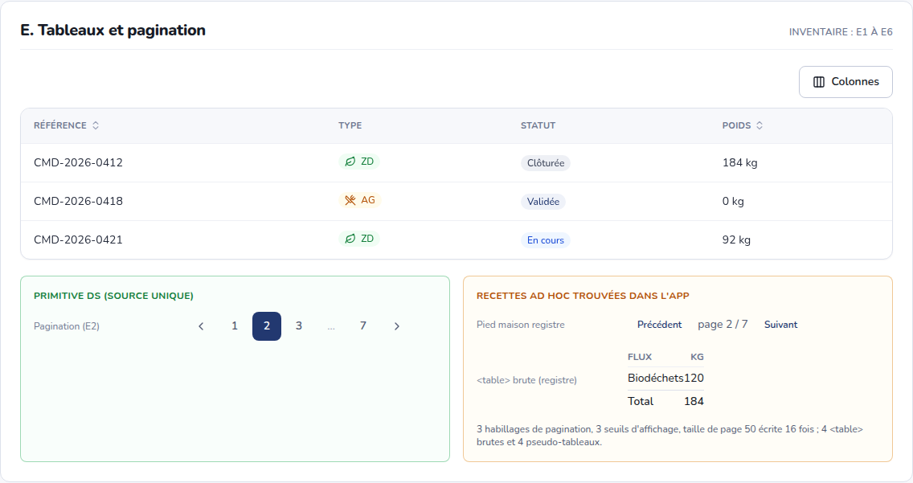

## F. Formulaires (F1 à F11)

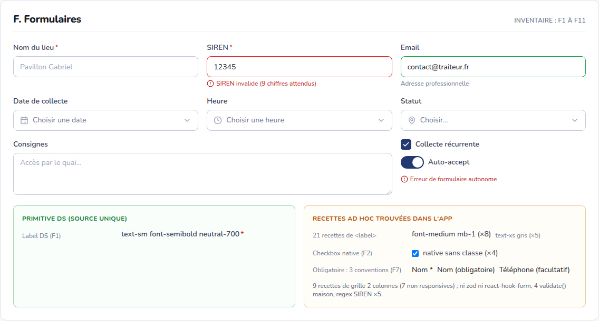

## G. Modales et confirmations (G1 à G5, B5)

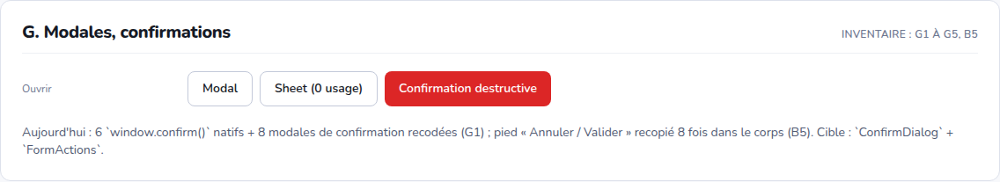

| Modal                              | Confirmation destructive (à remplacer par `ConfirmDialog`) | Sheet (0 usage)                   |
| ---------------------------------- | ---------------------------------------------------------- | --------------------------------- |
| 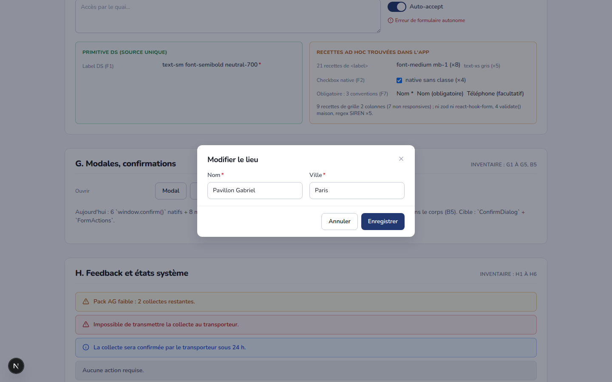 | 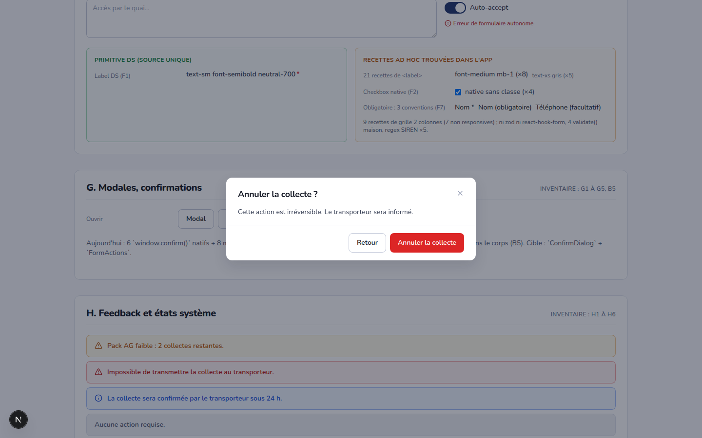            | 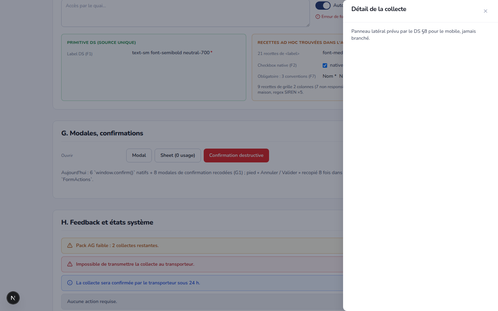 |

## H. Feedback et états système (H1 à H6)

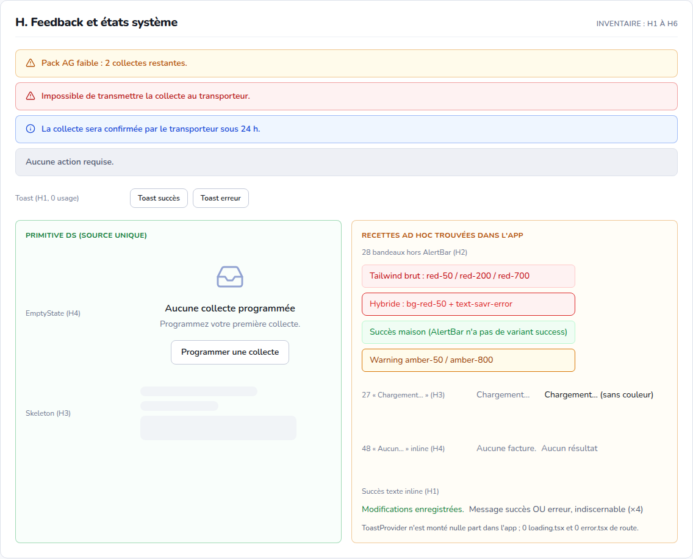

Toast (primitive jamais montée dans l'app) :

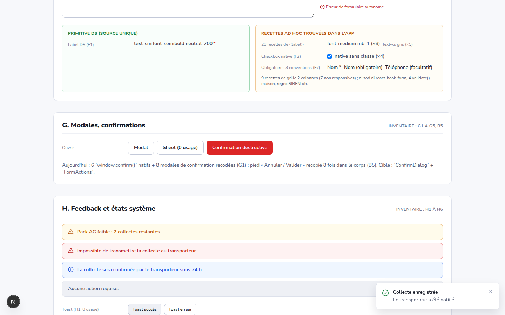

## I. En-têtes, cards, KPI (I1 à I9, G3)

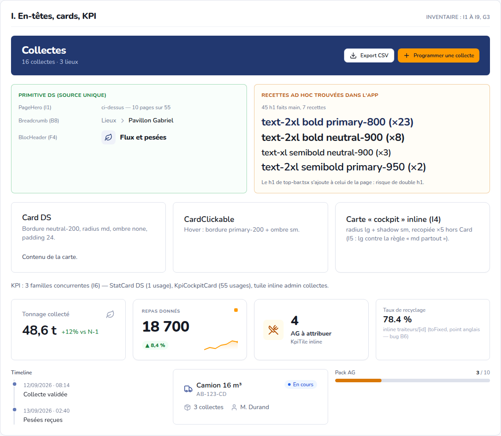

## Mobile 390 px


